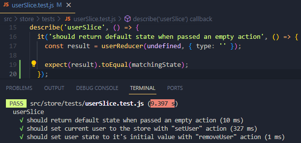

# Блог на React, Firebase, AntD

**_SPA-проект получения с самостоятельно настроенного сервера Firebase и отображения списка постов с CRUD-операциями и OAuth авторизацией пользователей, а также имплементацией базового тестирования_**

---

### Использован шаблон c-r-a

Для первичной инициализации проекта в его директории сперва нужно установить зависимости с помощью команды:

```sh
npm install
```

Для локального запуска проекта нужно использовать команду

```sh
npm start
```

### **_Важно!_** Ключи (переменные) для настройки окружения и конфигурации firebase хранятся локально и отсутствуют в репозитории. Необходим файл .env.local

## В проекте настроен CI/CD через GitHub Actions.


**_Деплой реализован через Netlify. Ссылка на продакшн стенд: [fireblog-project](https://fireblog-project.netlify.app/)_**

### Автоформатирование и проверка кода реализованы через Prettier и ESLint.

Для запуска линтинга нужно использовать команду:

```sh
npm run lint
```

Для запуска автоисправления линтинга нужно использовать команду:

```sh
npm run lint:fix
```

## В проекте использованы библиотеки

- [x] Firebase;
- [x] React Router;
- [x] Redux Toolkit;
- [x] Ant Design;
- [x] react-icons;
- [x] prettier;
- [x] react-error-boundary;

### Авторизация пользователей происходит через **Firebase** посредством провайдера Google (т.е. по обычному google-аккаунту).

Контроль авторизации (в том числе сохранение пользователя при ранее выполненном входе) происходит на стороне сервера. Для реализации контроля за состоянием авторизации на стороне клиента использован кастомный хук **useAuth** с изменением состояния загрузки (отображения спиннера) и перенаправлением неавторизованного пользователя на страницу логина. Внутри использован слушатель через useEffect на хук Firebase `onAuthStateChanged`, позволяющий проверять авторизацию пользователей при каждом обращении к сервису.

Логика логаута оставлена внутри компонента LogoutButton. Для выхода из аккаунта использован хук Firabase `signOut`.

### Для стейт менеджмента использован Redux Toolkit.

В сторе описан слайс userSlice, где хранятся данные юзера, которые сохраняются туда в том числе при проверке авторизации через Firebase и подтягивании данных пользователя с сервера.
Для упрощения доступа к данным пользователя реализован кастомный хук **useUserInfo**, куда вынесена логика обращения к стейту, хранящемуся в сторе Redux через хук `useSelector`.

### Реализовано базовое тестирование.

1. Написаны базовые тесты для Redux-слайса `userSlice` (тестируется сам редьюсер и синхронные экшны):



2.  [**Unit-тесты**](https://github.com/KamajorQA/Fire-Blog/tree/master/src/components/tests) с **jest-моками** для компонентов.

3.  Тесты для кастомных хуков `useUserInfo` и `useControlNavigation`.

### Дополнительные пояснения:

Для общего дизайна использована библиотека UI-компонентов **Ant Design**.

Описан кастомный хук **useControlNavigation** для совместной навигации в боковом меню (по ссылкам) и хедере (на лого) _(5ая версия AntD вынуждает использовать `useNavigation` вместо компонентов Link и NavLink из react-router-dom)_.

Реализована обработка формы добавления нового поста с трансформацией данных для незаполненного необязательного поля (ссылка на изображение).  
Поля формы валидируются (по минимальной длине, url - по формату, по заполненности):  


React Router использован для навигации между страницами **Home** / **User Info** / **Create Post** / **Contacts** / **Login** / **Not Found**  
Рендер вложенных страниц реализован через компонент `<Outlet />` библиотеки `react-router-dom`
Также реализовано управление неавторизованным пользователем через хук `useNavigate`.

Работа с **SVG** организована и с использованием иконок библиотеки `react-icons`, и с использованием локальных файлов из директории `assets/icons`.

На главной странице реализована **пагинация** с возможностью выбора количества отображаемых на странице карточек с динамическим обновлением выводимой страницы.

---

Любые замечания по работе приложения приветствуются 😊
